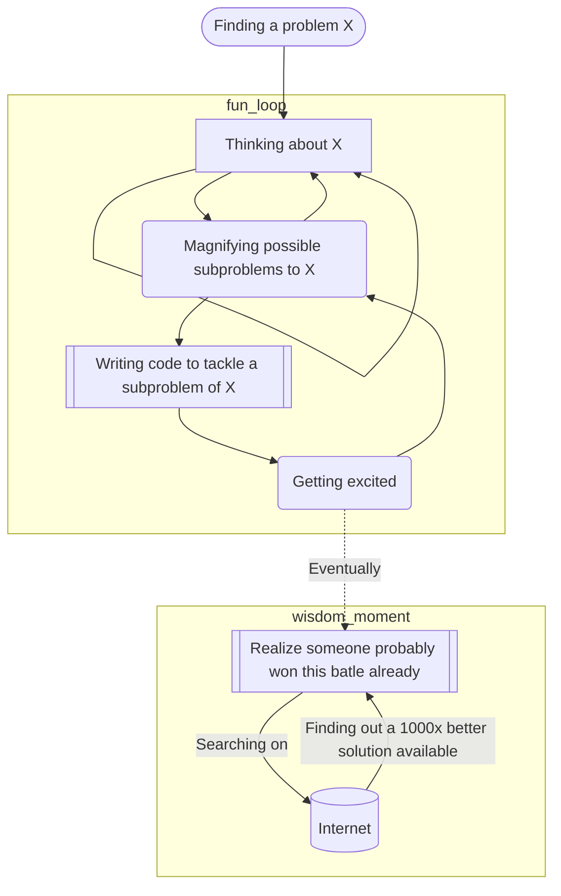

# Reinventing the wheel while learning about bot detection



Last week a friend planted a seed of doubt in my mind! How do we write an automated browser task without getting noticed by a bot detector?

Well, I started raising questions about the problem and its subproblems:
* How does a bot detector work?
  * Identifying repeated/predictable input values.
  * Looking at HTTP metadata like headers `User-Agent`.
  * Detecting bot behavior by traits such as typing speed, lack of mouse movement, etc.
  * Noticing a lot of actions from a single actor (same IP/user agent).
  * And so on...

Once I had thought about a bunch of subproblems, I started writing code to solve each one of them. 

To fight the predictability of the input values, I wrote small functions to randomly generate data based on some arbitrary rules (for instance name):
```python
import random

us_first_names  = ["Alice", "Bob"]
us_middle_names = ["L.", "N."]
us_last_names   = ["Smith", "Johnson"]

br_first_names  = ["Maria", "Ana"]
br_middle_names = ["Paula", "A."]
br_last_names   = ["Oliveira", "Santos"]

name_provider = {
 "us": {
    "first_names": us_first_names,
    "middle_names": us_middle_names,
    "last_names": us_last_names,
  },
   "br": {
    "first_names": br_first_names,
    "middle_names": br_middle_names,
    "last_names": br_last_names,
  }
}

def generate_name():
  lucky_factor = random.randint(1,100)
  name_country = "us" # 95% of time we'll use "us"
  if lucky_factor > 95: # 5% of time we'll use "br"
    name_country = "br"
    
  lucky_factor = random.randint(1,100)
  middle_name = "" # 80% of time we won't use a middle name
  if lucky_factor > 80:  # 20% of time we'll have a middle name
    middle_name = random.choice(name_provider[name_country]["middle_names"]) + " "
  
  first_name = random.choice(name_provider[name_country]["first_names"])
  last_name = random.choice(name_provider[name_country]["last_names"])
  full_name = f"{first_name} {middle_name}{last_name}"
  
  lucky_factor = random.randint(1,100)
  if lucky_factor > 95: # 5% of time we'll use lowercase
    full_name = full_name.lower()
    
  lucky_factor = random.randint(1,100)
  if lucky_factor > 98: # 2% of time we'll drop the last character
    full_name = full_name[:-1]
    
  return full_name
```

I decided to use selenium so changing the `User-Agent` and simulating a human-like typing experience would be possible:

```python
from selenium import webdriver
from selenium.webdriver.chrome.options import Options
from selenium.webdriver.common.by import By

import random
import time

# adding a different user-agent and proxy
opts = Options()
opts.add_argument(f"user-agent={mylib.generate_user_agent()}")
opts.add_argument(f"--proxy-server={mylib.fetch_random_proxy()}")

driver = webdriver.Chrome(chrome_options=opts)

def average_people_typing():
    time.sleep(random.randint(60,200)/1000) # delaying ~= from 60ms to 220ms

input_element = driver.find_element(By.NAME, "q")
input_element.click()
input_element.clear()

full_name = mylib.generate_name()
for chr in full_name:
  average_people_typing()
  input_element.send_keys(chr)

```

Yeah, I didn't show you but I wrote lots of functions, things like a proxy fetcher:

```python
from urllib.request import urlopen
import random

def fetch_random_proxy():
    proxies_source_url ="raw.githubusercontent.com"
    proxies_source_path ="/TheSpeedX/SOCKS-List/master/http.txt"
    response = urlopen(f"https://{proxies_source_url}{proxies_source_path}")
    proxies_list = response.read().decode('utf-8').split("\n")

    return random.choice(proxies_list)
```

Anyway, I knew it works but does it fools a bot detector? How can I test if my code can bypass a detector? It turns out that there are sites where you can test your code against real bot detectors:

* https://bot.sannysoft.com/
* https://bot.incolumitas.com/

I ran proudly my lil' monster and it didn't pass at all 😞! It actually scored so low that the sites were certain that it was a bot. I started researching on the Internet what people were doing:

* https://stackoverflow.com/questions/33225947/can-a-website-detect-when-you-are-using-selenium-with-chromedriver
* https://github.com/soumilshah1995/Preventing-Selenium-from-being-detected/blob/main/master.py
* https://newbedev.com/selenium-webdriver-modifying-navigator-webdriver-flag-to-prevent-selenium-detection
* binary patch `chromedrive` vim %s/cdc_/lhe_/g
* and so on.

[The more I see, the less I know](https://youtu.be/yuFI5KSPAt4?t=189)! Long story short, there are solutions (obviously) to aid you in your journey:
* provisioning the selenium/chrome driver https://github.com/ultrafunkamsterdam/undetected-chromedriver
* fake data providers https://github.com/joke2k/faker
* ...

In the end, I passed the bot detectors (_Standing on the shoulders of giants_) and build a pretty simple (IMO) and useful thin layer to speed up my automation:

```python
import runner
import step_creator
import human_delay

import undetected_chromedriver as uc
from selenium.webdriver.common.by import By
from selenium.webdriver.common.keys import Keys
from faker import Faker

def main():
    driver = uc.Chrome()

    random_name = Faker(['en_US', 'pt_BR']).first_name()
    
    # I'm using builders to avoid repetition
    search_element_query, search_element_function = step_creator.create_human_field_filler(random_name + Keys.RETURN, (By.NAME, "q"))
    list_element_query, list_element_function = step_creator.create_human_fields_click(0, (By.CSS_SELECTOR, ".repo-list-item .v-align-middle"))

    steps = [
        [f"Search for {random_name}", search_element_query, search_element_function],
        ["Click on the first item", list_element_query, list_element_function],
    ]

    # I also create a runner so I can focus only on building the steps
    runner_instance = runner.Runner(driver, "https://github.com/", steps)
    runner_instance.run()

    human_delay.delay(3000, 4000) # seconds to take a printscreen
    driver.get_screenshot_as_file(f"{random_name}-page.png")

    print('\a') # beebing just for fun
    print('\a')

if __name__ == "__main__":
    main()
```

Now I could finally run my automation 1000 times, randomly spreading the "users" between 30 seconds and 5 minutes.

```bash
for i in `seq 1 1000`; do sleep $((30+RANDOM % (300-30))) && python3.10 usage.py ; done
```

I'm always reinventing the wheel and then I got bored, search for what I was building to find out 💡 someone did a 1000x better solution than mine 🤡!

PS: if you want to run that on your computer you must have `python3` and `pip3.10 install undetected-chromedriver Faker`.
