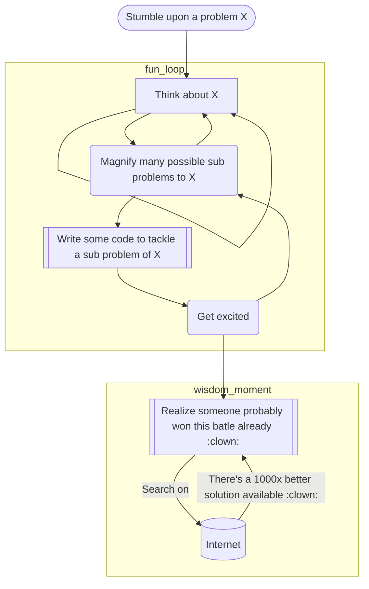

# Reinventing the wheel while fighting bot dection

Last week a friend of mine planted (without noticing) a doubt in my brain that got me hooked to study and learn! Essentially when you're automating a web tsak (like going to site www.example.com, log in, enter a query, submit it, and click on the first results) 

I never learn, I always start by reinventing the wheel then I got bored and search for what I'm building and 💡 someone did that 1000x better than me 🤡!

# Install

pip3.10 install undetected-chromedriver Faker

# Download the driver within the same version of your running browser

http://chromedriver.storage.googleapis.com/index.html

# Avoid site detection https://stackoverflow.com/questions/33225947/can-a-website-detect-when-you-are-using-selenium-with-chromedriver

https://github.com/ultrafunkamsterdam/undetected-chromedriver

https://bot.sannysoft.com/
https://bot.incolumitas.com/

https://github.com/soumilshah1995/Preventing-Selenium-from-being-detected/blob/main/master.py
https://newbedev.com/selenium-webdriver-modifying-navigator-webdriver-flag-to-prevent-selenium-detection
vim %s/cdc_/lhe_/g

# Run

for i in `seq 1 5`; do sleep $((6+RANDOM % (12-6))) && python3.10 usage.py ; done

# Proxies

curl https://raw.githubusercontent.com/TheSpeedX/SOCKS-List/master/http.txt
